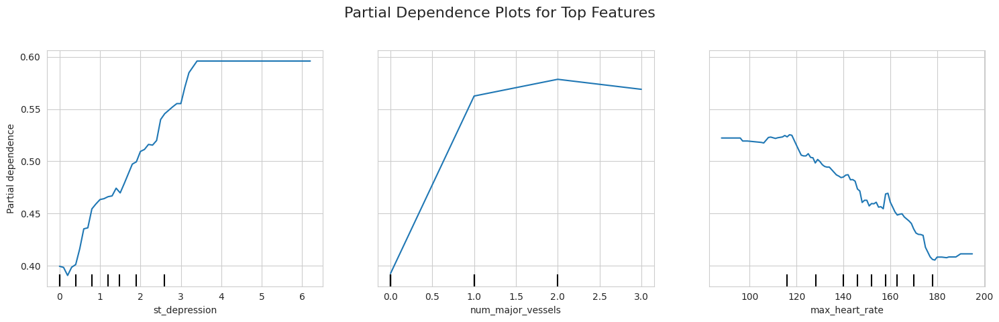

# Heart Disease Prediction using Explainable AI (XAI)

## Overview

This project develops a Random Forest-based machine learning model to predict the presence of heart disease using clinical and diagnostic features from the UCI Heart Disease dataset.

In addition to achieving strong predictive performance, the project focuses on model interpretability through Explainable AI (XAI) techniques. Permutation Feature Importance and Partial Dependence Plots (PDPs) are used to understand which features influence predictions and how they affect the model's decisions.

The final model achieved an accuracy of **81.67%** while providing clinically meaningful insights into heart disease risk factors.

---

## Dataset

**Dataset:** UCI Heart Disease Dataset

**Source:**  
https://www.kaggle.com/datasets/redwankarimsony/heart-disease-data

### Data Preprocessing

- Selected 14 clinically relevant features
- Handled missing values and cleaned the dataset
- Converted the target variable into binary classification:
  - **0** = No Disease
  - **1** = Disease
- Applied one-hot encoding to categorical features

### Dataset Statistics

- Original Records: **920**
- Cleaned Records: **299**

---

## Technologies Used

- Python
- Pandas
- NumPy
- Scikit-Learn
- Matplotlib
- Seaborn
- Jupyter Notebook

---

## Machine Learning Pipeline

1. Data Cleaning and Preprocessing
2. Exploratory Data Analysis (EDA)
3. Feature Engineering
4. One-Hot Encoding
5. Random Forest Model Training
6. Model Evaluation
7. Permutation Feature Importance Analysis
8. Partial Dependence Plot (PDP) Analysis

---

## Model Performance

### Random Forest Classifier

**Accuracy: 81.67%**

### Confusion Matrix


---

## Explainable AI (XAI)

### 1. Permutation Feature Importance

Permutation Feature Importance was used to identify the most influential features affecting model predictions.

#### Most Important Features

- Thalassemia Type
- ST Depression
- Chest Pain Type
- Number of Major Vessels

These features showed the largest impact on prediction accuracy when shuffled.

---

### 2. Partial Dependence Plots (PDP)

Partial Dependence Plots were used to visualize how important features influence the probability of heart disease.



### Key Insights

- ST Depression values above 1.0 significantly increase predicted heart disease risk.
- Risk increases with the number of blocked major vessels.
- Chest Pain Type is a strong predictor of heart disease.
- The model captures clinically meaningful relationships between patient features and disease risk.

---

## Project Structure

```text
heart-disease-xai/
│
├── ML_Project.ipynb
├── README.md
├── ML_Project_24AI10021_Final.pdf
├── confusion matrix.png
└── pdp.png
```

---

## Report

A detailed project report explaining the methodology, experiments, results, and interpretability analysis is included in:

```text
ML_Project_24AI10021_Final.pdf
```

---

## Key Learning Outcomes

- Machine Learning Workflow
- Data Preprocessing
- Exploratory Data Analysis
- Random Forest Classification
- Model Evaluation
- Explainable AI (XAI)
- Feature Importance Analysis
- Partial Dependence Plots

---

## Author

**Sujeeth Kumar Chunarkar**  
B.Tech, Artificial Intelligence  
Indian Institute of Technology Kharagpur

**Course:** Introduction to Machine Learning

**Project Type:** Course Project

---

## License

This repository is intended for academic and educational purposes.
